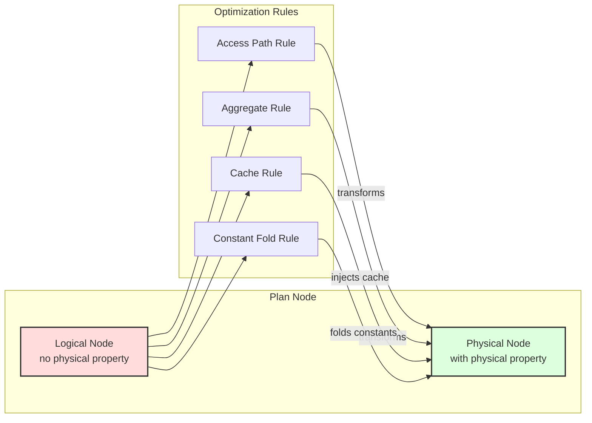

# Quereus Query Optimizer

> **Stability: Internal** — see [Stability Tiers](stability.md#tiers).

The optimizer turns the logical plan the builder produced into a physical plan the
emitter can compile, by running rewrite rules over the plan tree in a fixed sequence of
passes. This document is the **hub**: it covers the pass framework, the shared machinery
every rule stands on (physical properties, cost model, attribute identity, visited
tracking), and the discipline a new rule must follow. The rules themselves, and the
subsystems that grew large enough to read on their own, live in the topic documents below.

## Topic documents

| Document | Covers |
| --- | --- |
| [Optimizer Rules](optimizer-rules.md) | The rule catalog — one line per rule, grouped by `src/planner/rules/` subdirectory. |
| [Optimizer Rule Families](optimizer-rule-families.md) | Deep-dives: materialized-view read-side rewrite, constant folding, the predicate family, cardinality/key reasoning. |
| [Optimizer Joins](optimizer-joins.md) | Join ordering (QuickPick), physical join selection, fan-out lookup joins, join key propagation. |
| [Optimizer Retrieve Push-down](optimizer-retrieve.md) | The `RetrieveNode` module boundary, access-path selection, correlated access, TVF property declarations. |
| [Optimizer Streaming Recognition](optimizer-streaming.md) | Asof scan, and the monotonic LIMIT/OFFSET, range-scan, and window recognitions. |
| [Optimizer Parallel Track](optimizer-parallel.md) | Recognition rules for concurrent execution: async gather, eager prefetch. |
| [Optimizer Assertion Analysis](optimizer-assertions.md) | Row/group/global classification and binding-aware delta planning. |
| [Functional Dependencies](optimizer-fd.md) | FDs, equivalence classes, constant bindings, inclusion dependencies, coverage proving. |
| [Constant Folding System](optimizer-const.md) | The three-phase constant-folding algorithm in full. |
| [Optimizer Visited Tracking](optimizer-visited-tracking.md) | Context-scoped visited tracking: the per-pass traversal cache, DAG handling, rule-application control. |
| [Optimizer Conventions](optimizer-conventions.md) | House style for writing a rule. |
| [Progressive Query Optimization](progressive-optimizer.md) | The tiered, feedback-driven optimization strategy. |

## Philosophy

The Quereus optimizer embodies several core principles that guide its design and implementation:

### Virtual Table Centric
The optimizer is built around the premise that all data access happens through virtual tables. This means optimization decisions must respect the capabilities and constraints exposed by each virtual table module through the `BestAccessPlan` API.

### Streaming First
Quereus prioritizes streaming execution over materialization. The optimizer favors transformations that preserve pipeline-able operations and only introduces blocking operations (sorts, materializations) when absolutely necessary for correctness or significant performance gains.

### Attribute-Based Identity
Column identity is tracked through stable attribute IDs rather than names or positions. This enables robust column reference resolution across arbitrary plan transformations without the fragility of name-based or position-based systems.

### Single Hierarchy, Dual Phase
Rather than maintaining separate logical and physical plan hierarchies, Quereus uses a single `PlanNode` tree that transitions from logical to physical through property annotation. This eliminates duplication while maintaining clear phase separation.

### Cost-Based with Heuristic Fallbacks
While the optimizer uses cost estimates to guide decisions, it provides sensible heuristic defaults when statistics are unavailable. This ensures reasonable plan quality even without detailed table statistics.

### Property based rules
Rather than tying rules to specific node types, as much as possible, the optimizer and its rules are tied to properties of the nodes, such as the physical properties, or the node's data type.  This reduces direct dependencies, making the system more robust and flexible.

## Architecture Overview

The Quereus optimizer operates as a transformation engine between the plan builder and runtime emitter:

```
┌─────────────┐     ┌──────────────┐     ┌─────────────┐     ┌──────────────┐
│   Parser    │ --> │   Builder    │ --> │  Optimizer  │ --> │   Emitter    │
│             │     │              │     │             │     │              │
│ SQL → AST   │     │ AST → Logic  │     │Logic → Phys │     │ Phys → Code  │
└─────────────┘     └──────────────┘     └─────────────┘     └──────────────┘
```

The optimizer uses a **multi-pass architecture** where different categories of transformations occur in separate tree traversals. Each pass can use either top-down or bottom-up traversal order depending on its requirements:



### Multi-Pass Optimization System

The optimizer executes transformations through a series of **optimization passes**, each with a specific purpose and traversal order:

#### Pass 0: Constant Folding (Bottom-up)
- **Purpose**: Pre-evaluate constant expressions before other optimizations
- **Traversal**: Bottom-up to evaluate from leaves to root
- **Implementation**: Custom execution using runtime expression evaluator
- **Result**: Simplified plan with literals replacing constant expressions

#### Pass 1: Structural Transformations (Top-down)
- **Purpose**: Restructure the plan tree for optimal execution boundaries
- **Key Rules**: `ruleGrowRetrieve`, `rulePredicatePushdown`, `ruleScalarCSE`
- **Traversal**: Top-down to see parent context for sliding operations
- **Result**: Operations pushed into virtual table boundaries where beneficial; duplicate scalar expressions eliminated

#### Pass 2: Physical Selection (Bottom-up)
- **Purpose**: Convert logical operators to physical implementations
- **Key Rules**: `ruleSelectAccessPath`, `ruleAggregatePhysical`
- **Traversal**: Bottom-up to select implementations based on child properties
- **Result**: Executable physical plan with concrete operators

#### Pass 3: Post-Optimization (Bottom-up)
- **Purpose**: Final cleanup, materialization decisions, and caching
- **Key Rules**: `ruleCteOptimization`, `ruleMutatingSubqueryCache`, `ruleNestedLoopRightCache`, `ruleScalarSubqueryCache`
- **Nested-loop right-side caching**: `rule-nested-loop-right-cache` fires on Join nodes right after `mutating-subquery-cache`. By this pass every equi-join `join-physical-selection` wanted has already become a hash/merge join, so any surviving logical `JoinNode` is a nested loop — plain, or an index-nested-loop whose right leaf is a correlated per-outer-row `IndexSeek` — whose left-driven types (`inner`/`left`/`cross`/`semi`/`anti`) re-open the right pipeline once per left row. The rule wraps a **pure, deterministic, uncorrelated, non-CTE, size-bounded** right side in a `CacheNode` so the right side is materialized once and replayed — decisive on a high-per-read-latency vtab. (The uncorrelated gate is what keeps an index-nested-loop's seek out of the cache: freezing a per-outer-row seek would replay the first row's matches for every row.) Where `mutating-subquery-cache` handles impure right sides, this rule handles pure ones; the two partition the space and the already-cached gate prevents double-wrapping.
- **Where an `IN (SELECT …)` predicate ends up**: a filter-position `IN` that decorrelation turns into a semi join flows through this pass in stages, and different shapes stop at different stages. A correlated / non-deterministic / side-effect-bearing / projection-position `IN` never leaves the runtime **set probe** (`emitIn` materializes the inner once per execution and probes per row). A decorrelated semi join whose both sides are monotonic on the join key becomes a **merge semi join** (`monotonic-merge-join`); otherwise `join-physical-selection` picks a **hash semi join**. Finally `rule-key-set-seek` (see `optimizer-rules.md`) replaces a qualifying semi join — hash (id `key-set-seek`) **or merge** (id `key-set-seek-merge`) — with a **`KeySetSemiJoinNode`**: the key set is materialized once at runtime and, when small enough by the module's own costs, handed to the target's module as an ordinary single-column `plan=5` multi-seek so only the matching index windows are read. The merge anchor is what catches the most common shape, `where pk in (select …)` on the target's primary key: both sides advertise a key walk, so it becomes a merge semi join before the hash anchor could ever see it. It fires only when the seek index is the walk index (`seekPreservesTargetOrder`) — then the node claims the target's own `ordering` / `monotonicOn`, so an ORDER BY the walk absorbed stays served through the rewrite — and only when the key source's row estimate does not already exceed the runtime seek threshold. The node's probe is unconditional, so the seek can only over-fetch (trimmed by the probe), never change the answer; shapes that fail its gates (no usable index, a pushed limit/offset, target/key types that do not share one seek key space, semantic-ordering keys, unsafe collation cover, a load-bearing leaf emission order the seek cannot reproduce) simply keep the join they arrived as. A target leaf that is itself an `IndexSeek` — another indexed column of the same table also filtered, e.g. `where status = 'x' and id in (select …)` — is admitted too: the seek is kept as the target unchanged and the predicate its `FilterInfo` enforces (recorded in `pushedConstraints`) is re-applied as a `Filter` directly above the new node, so the runtime's seek branch cannot lose it while its scan branch remains byte-for-byte the displaced plan. The key-space gate admits any pair drawn from `INTEGER` / `REAL` / `NUMERIC` — a numeric key's identity is its value, not its JS representation — so `where i in (select r from …)` seeks rather than falling back.
- **Traversal**: Bottom-up for global analysis and cache injection
- **Result**: Optimized plan with caching and materialization points

#### Pass 3.5: Materialization Advisory (single whole-tree pass, order 35)

> **Invariant:** [OPT-004](invariants.md#opt-004--a-custom-execute-pass-argues-its-own-soundness)

- **Purpose**: Inject caching where reference analysis shows materialization pays off
- **Implementation**: A custom-`execute` pass (no per-node rules) that runs `MaterializationAdvisory.analyzeAndTransform` **once** over the whole plan — one reference-graph build with global parent counts, versus the previous 12 per-anchor-type rule firings that each rebuilt a graph over their own subtree. Runs after Post-Optimization so it observes the `CacheNode`s already injected by `cte-optimization` (it skips `nodeType === Cache`, avoiding double-wrapping). See `createMaterializationPass` in `framework/pass.ts` for the coverage and side-effect-soundness rationale.
- **Result**: `CacheNode`s wrapping relational subtrees that benefit from materialization (multi-parent sharing). Nested-loop-inner (single-parent, loop-context) caching is handled by the dedicated `rule-nested-loop-right-cache` above, not here — the advisory's former `appearsInLoop` / `loopMultiplier` scaffolding never fired (the logical reference graph makes no execution-strategy assumptions) and has been removed. A `CacheNode` is a physical pass-through: it preserves its source's relational physical properties (FDs, keys, ordering, monotonicOn, equivalence classes, INDs, update-lineage) so wrapping a subtree never degrades downstream key-based optimizations.
- **CTE materialize mark**: the same pass (reusing its single reference graph) resolves the shared-materialization decision for non-recursive CTEs. A `CTENode` with two-plus referencing parents, or an explicit `MATERIALIZED` hint, is rewritten with `materialize: true` — unless the user wrote `NOT MATERIALIZED`, which is honored as an opt-out (the CTE then re-executes per reference). The rewrite is **memoized by node identity** so a CTENode shared by several `CTEReferenceNode` parents is rewritten once and stays shared. The runtime keys its once-per-execution buffer on the CTE's `tableDescriptor`, not on the plan id, so the buffer is still shared if a later pass does split the node (see `docs/runtime.md`). CTEs (recursive and not) are excluded from the advisory's `CacheNode` recommendations: a wrap could never land (`CTEReferenceNode.withChildren` rejects a non-CTE child), and the mark supersedes the intent.
- **Data-modifying CTE — always buffered, decided at build time**: a CTE whose body is an `INSERT` / `UPDATE` / `DELETE` (with `RETURNING`) is constructed with `materialize: true` in `planner/building/with.ts` and never consults this gate (`markCTEMaterialization` short-circuits on the already-set flag). Its write must happen exactly once per statement execution however many times the query names it, and the gate above cannot carry that decision for two reasons: the reference count **undercounts** — two mentions using the same alias share one `CTEReferenceNode`, so the `CTENode` shows a single parent while both mentions still emit and run the body — and a `NOT MATERIALIZED` hint would license re-execution, i.e. a second write. The hint is therefore overridden for writing bodies, the same call the recursive branch makes below. Read-only bodies are untouched by this rule and keep flowing through the normal gate.
- **Recursive CTE materialize mark**: a recursive CTE referenced 2+ times is also marked `materialize` (on its `RecursiveCTENode`), so `emitRecursiveCTE` buffers the recursion once per execution and every reference replays it — without this, two interleaved streaming drives clobber each other on the shared working table and trip the iteration guard. This branch differs from the non-recursive one in three ways: (1) it gates on the **reference count summed per `tableDescriptor`**, because earlier passes duplicate a multi-referenced recursive CTE into distinct `RecursiveCTENode` instances (each with `parentCount` 1) that all share one descriptor; (2) it **ignores** the `MATERIALIZED` / `NOT MATERIALIZED` hint (honoring `NOT MATERIALIZED` would re-open the runaway — correctness wins); and (3) the same pass **forbids caching any node inside a recursive-case subtree** — those nodes re-evaluate every semi-naïve iteration against the changing working table, so a `CacheNode` there would freeze the delta to the first iteration's rows. The runtime keys the buffer on the shared `tableDescriptor` (see `docs/runtime.md`).

#### Pass 3.7: Final Estimates (Bottom-up, order 37)
- **Purpose**: Re-derive plan estimates that a later-than-Physical pass invalidated
- **Key Rules**: `filter-selectivity-final`
- **Why it exists**: a plan estimate is derived by a rule holding an `OptContext` (node accessors carry none) and cached on the node, so any later pass that *re-mints* that node drops the estimate with nothing behind it to restore the number — `FilterNode.withChildren` carries `selectivity` forward only when the predicate child is the same object, and the Materialization advisory above rebuilds every path on which it marks a `with` clause or injects a `CacheNode`. Rules registered here run behind every plan-mutating pass, so an estimate's survival no longer depends on which pass happened to touch its node last. Rules here must be fill-in-only (decline on a node that already carries the estimate), since they run after every cost reader has already consulted the earlier stamp.
- **Nothing plan-mutating may run behind it**: anything later-ordered that rewrites a node re-opens the hole, whether it arrives as a rule or as a whole pass. `test/optimizer/rule-manifest.spec.ts` asserts both statically — no `RULE_MANIFEST` entry targets a pass ordered after this one, and no pass ordered after it carries a custom `execute` (the shape Pass 3.5 has, which no manifest check could see). Today only `Pass 4: Validation` sits behind it, with neither.
- **Result**: every Filter the estimator can describe reaches emission with a real row estimate rather than the flat 0.5

#### Pass 4: Validation (Bottom-up)
- **Purpose**: Validate the correctness of the optimized plan
- **Implementation**: Structural and property validation checks
- **Result**: Verified executable plan or error if invalid

### Pass Framework (`src/planner/framework/pass.ts`)

The pass system provides a clean abstraction for multi-pass optimization:

```typescript
interface OptimizationPass {
  id: string;                          // Unique identifier
  name: string;                        // Human-readable name
  traversalOrder: TraversalOrder;      // 'top-down' or 'bottom-up'
  rules: RuleHandle[];                 // Rules belonging to this pass
  execute?: (plan, context) => plan;   // Optional custom execution
  order: number;                       // Execution order (lower first)
}
```

**Key Benefits**:
- **Separation of Concerns**: Each pass focuses on a specific optimization category
- **Proper Sequencing**: Structural transformations happen before physical selection
- **Flexible Traversal**: Each pass can choose its optimal traversal order
- **Clean Debugging**: Clear pass boundaries make optimization easier to understand
- **Depth safety**: Each pass enforces a per-pass depth budget of `max(tuning.maxOptimizationDepth, planInputDepth + tuning.optimizationDepthHeadroom)` so wide input shapes (deep AND chains, deep CASE) plan without tripping the guard, while a separate `tuning.maxRulesFired` budget catches runaway rule rewrites independent of input shape.

### Core Components

**Pass Manager** (`src/planner/framework/pass.ts`)
- Coordinates execution of all optimization passes
- Manages rule registration per pass
- Implements both top-down and bottom-up traversal strategies
- Provides hooks for custom pass execution logic

**Rule Engine** (`src/planner/optimizer.ts`)
- Registers rules to appropriate passes based on their purpose
- Creates optimization context for rule execution
- Integrates with pass manager for multi-pass optimization
- Provides debugging and tracing infrastructure

**Physical Properties** (`src/planner/framework/physical-utils.ts`)
- Captures execution characteristics: ordering, uniqueness, cardinality, monotonic-on-attribute
- `monotonicOn` (per `MonotonicOnInfo` in `nodes/plan-node.ts`) is stronger than `ordering`: it identifies an attribute the relation is totally ordered on (with optional `strict` to assert no duplicates), and is meaningful only for total-order-preserving sources (vtab access plans that advertise it; sort nodes; merge join). Propagation rules live alongside each operator's `computePhysical`.
- `rangeBoundedOn` is a non-relational annotation set by `monotonic-range-access` on physical leaves whose access plan walks a `MonotonicOn(x)` path bounded by a recognized range predicate on `x`. See [Streaming § Monotonic range-scan recognition](optimizer-streaming.md#monotonic-range-scan-recognition).
- Propagates properties through plan transformations
- Enables property-based optimization decisions

**Rule Framework** (`src/planner/framework/`)
- Standard rule signature: `(node, context) → node | null`
- Context provides access to database, statistics, and tuning parameters
- Rules are pure functions that return transformed nodes or null

**Generic Tree Rewriting** (`PlanNode.withChildren()`)
- Every plan node implements generic tree reconstruction
- Preserves attribute IDs during transformations
- Eliminates manual node-specific handling in optimizer core

## Design Decisions

### Immutable Plan Nodes

> **Invariant:** [OPT-008](invariants.md#opt-008--plan-nodes-are-immutable)

Plan nodes are never mutated after construction. All transformations create new nodes, ensuring:
- Clear debugging with before/after comparisons
- Safe concurrent access during optimization
- Predictable transformation behavior

### Attribute ID Preservation

> **Invariant:** [OPT-012](invariants.md#opt-012--withchildren-preserves-attribute-ids)

The optimizer guarantees that attribute IDs remain stable across transformations:
```typescript
// ProjectNode preserves original attribute IDs
const newProjections = this.projections.map((proj, i) => ({
  node: newProjectionNodes[i] as ScalarPlanNode,
  alias: proj.alias,
  attributeId: proj.attributeId // ✅ Preserved from original
}));
```

### Two-Phase Transformation
1. **Logical Phase**: Builder creates plan nodes without physical properties
2. **Physical Phase**: Optimizer transforms and annotates with physical properties

This separation allows the builder to focus on semantic correctness while the optimizer handles execution strategy.

### Rule-Based Transformation
Optimization logic is organized into focused, composable rules:
- Each rule has a single responsibility
- Rules can be enabled/disabled independently  
- New optimizations can be added without modifying core code
- Rules are registered per node type for efficient dispatch

## Engineering Considerations

### Generic Tree Walking
The optimizer uses a generic tree walking mechanism via `withChildren()`:

```typescript
private optimizeChildren(node: PlanNode): PlanNode {
  const originalChildren = node.getChildren();
  const optimizedChildren = originalChildren.map(child => this.optimizeNode(child));
  
  const childrenChanged = optimizedChildren.some((child, i) => child !== originalChildren[i]);
  if (!childrenChanged) {
    return node;
  }
  
  return node.withChildren(optimizedChildren); // Attribute IDs preserved
}
```

This eliminates error-prone manual reconstruction and ensures consistent handling across all node types.

### Cost Model Integration
Cost estimation is centralized in `src/planner/cost/index.ts`:
- Consistent formulas across optimization rules
- Tunable parameters via `OptimizerTuning`
- Clear units (rows, cost units, bytes)

#### Conjunct cost tiers

`cost/conjunct-cost.ts` ranks WHERE/HAVING conjuncts for
`rule-filter-conjunct-ordering` on a three-part key
(`compareConjunctRank`): a coarse `ConjunctCostTier`
(`Pure` < `Volatile` < `Subquery`) first; within a tier, estimated filtering
bought per unit work — `(1 - selectivity) / max(subtreeCost, 1e-9)`,
descending — with plain `getTotalCost()` breaking ratio ties. Raw subtree cost
alone misorders across tiers: node-count-derived cost
does not model "opens a whole sub-program per row", so a tableless scalar
subquery (`(select f())`, ≈0.051) costs *less* than a three-term arithmetic
expression (≈0.053) and barely more than a modulo — pure cost would run the
subquery before the arithmetic. The tier is the structural signal instead: any
relational descendant ⇒ `Subquery`, else any non-deterministic node ⇒
`Volatile`, else `Pure`.

**Why the tier stays the primary key.** The textbook rank is
`(fraction rejected) / (cost to run)` applied globally, but that needs a cost
denominator comparable across every conjunct — which is exactly what the tier
exists to say quereus does *not* have. Promoting a `Subquery`-tier conjunct
ahead of a `Pure` one because statistics say it rejects 95% would bet a
*measured* selectivity against an *unmeasured* per-row sub-program cost. Within
a tier the conjuncts are the same structural class, so cost is comparable there
and the ratio is meaningful.

Per-conjunct selectivities come from the shared estimator in
`planner/stats/conjunct-selectivity.ts`, gated on `statsOnlySelectivity` — real
statistics only. When **no** conjunct in a filter gets a real estimate the rule
sorts with the cost-only `compareConjunctCost` verbatim (an explicit branch,
not a limit argument), so a query with no `ANALYZE`d statistics orders
bit-identically to the pre-selectivity rule. In the mixed case an unknown
conjunct is assigned `UNKNOWN_CONJUNCT_SELECTIVITY` — which *is*
`DEFAULT_FILTER_SELECTIVITY` (0.5), the engine's one "nobody knows" fraction —
so "no information" is the neutral position: a measured-stronger conjunct
(s < 0.5) sorts ahead of unknowns, a measured-weaker one behind, and unknowns
keep their cost order among themselves (constant benefit ⇒ descending
benefit/cost degenerates to ascending cost). Selectivities are clamped to
[0, 1] before the benefit is computed, and the 1e-9 cost floor is a
divide-by-zero guard only — no real conjunct has zero subtree cost.

The module is deliberately **not** re-exported from
`cost/index.ts` — `nodes/filter.ts` imports `cost/index.ts`, and conjunct-cost
imports plan-node + characteristics (and now `DEFAULT_FILTER_SELECTIVITY` from
`nodes/filter.ts` itself), so a re-export would create an import cycle.

Reordering preserves the row set (AND commutes under three-valued logic, and a
Filter rejects `false` and `NULL` alike) but it does **not** preserve which
conjuncts get evaluated, so a guard idiom (`v <> 0 and 10 / v > 1`) is only
safe while no scalar expression raises. Every arithmetic edge quereus defines
returns NULL rather than throwing, so this is inert today; note that
selectivity adds a second route past a guard — a statistics-strong conjunct
can sort ahead of a cheaper same-tier guard even where cost alone would have
kept the guard first. If a scalar function
that throws on bad input ever ships, gate the reorder on a per-function
"may raise" trait, or require CASE for guarding as PostgreSQL does.

#### Self-cost-only convention

> **Invariant:** [OPT-016](invariants.md#opt-016--estimatedcost-is-self-cost-only), [OPT-018](invariants.md#opt-018--the-total-cost-memo-is-invalidated-on-mutation)

`PlanNode.estimatedCost` stores **only the node's own incremental (self) cost**,
excluding its children. The whole-subtree cost is `PlanNode.getTotalCost()`, which
is the **sole** place child costs are summed — it walks `getChildren()` and adds
each child's total to this node's self-cost.

A node constructor must never fold `child.getTotalCost()` (or a child's
`estimatedCost`) into its own `estimatedCost`. Doing so double-counts the child once
`getTotalCost()` sums the children again, which compounds with nesting depth and
inflates deeply nested plans exponentially — skewing which plan the optimizer picks.
The only genuine leaf self-cost that reads an `estimatedCost` is the vtab access
node's own `xBestIndex` IndexInfo cost (`table-access-nodes.ts`).

`getTotalCost()` is memoized per instance. This is sound because PlanNodes are
immutable (`withChildren` mints a fresh instance with a fresh, empty cache) and no
constructor calls `getTotalCost()`, so the first call always happens after the tree
is fully built. The one in-place mutator — `RecursiveCTENode.setRecursiveCaseQuery()`
— clears the memo via `invalidateTotalCostCache()`.

Two guards keep the two conventions from silently re-mixing (see
`test/planner/cost-additivity.spec.ts`):
- `validateCostAdditivity(plan)` (`planner/validation/plan-validator.ts`) asserts, per
  node, `getTotalCost() === estimatedCost + Σ child.getTotalCost()` and that
  `estimatedCost` is finite and `>= 0`.
- A static source-scan test fails if any node constructor reintroduces
  `getTotalCost(`/child `.estimatedCost` in its self-cost.

### Statistics Abstraction
The `StatsProvider` interface allows pluggable statistics sources:
```typescript
// Attribute id → the base-table column whose statistics describe it; undefined for an
// attribute minted above the base table. A caller holding a plan tree MUST pass one.
type ColumnStatsResolver = (attributeId: number) => string | undefined;

interface StatsProvider {
  tableRows(table: TableSchema): number | undefined;
  selectivity(table: TableSchema, pred: ScalarPlanNode, resolve?: ColumnStatsResolver): number | undefined;
  // Real statistics only — undefined instead of a heuristic guess.
  statsOnlySelectivity?(table: TableSchema, pred: ScalarPlanNode, resolve?: ColumnStatsResolver): number | undefined;
  joinSelectivity?(left: TableSchema, right: TableSchema, cond: ScalarPlanNode, resolve?: ColumnStatsResolver): number | undefined;
  distinctValues?(table: TableSchema, columnName: string): number | undefined;
  indexSelectivity?(table: TableSchema, indexName: string, pred: ScalarPlanNode): number | undefined;
}
```

The default provider is `CatalogStatsProvider`, which reads real statistics from `TableSchema.statistics` (populated by `ANALYZE` or `VirtualTable.getStatistics()`) and falls back to `NaiveStatsProvider` heuristics when unavailable. When catalog statistics include equi-height histograms, range and equality selectivity estimates use histogram interpolation rather than uniform assumptions.

`selectivity` always answers, substituting a fabricated per-nodeType guess when nothing real is available. `statsOnlySelectivity` is the same estimate *without* that fallback: it returns `undefined` when the table has no statistics, and also when the predicate's shape puts it out of reach of the statistics that do exist (`lower(cat) = 'x'` — the leaf estimator reads the column off a direct child of the comparison and finds none), when the compared column was minted *above* the base table (the resolver below reports it as having no origin), or when they answered only part of it (a partly-known `OR`, below). Callers that must not act on a fabricated number use it in place of `selectivity`.

**Column identity, not column name.** Each selectivity method takes an optional `ColumnStatsResolver` that maps a `ColumnReferenceNode`'s attribute id to the base-table column whose statistics describe it. `rule-filter-selectivity` builds one from `collectColumnOrigins` and passes it on every call. Without it a provider falls back to the name in the reference's AST, and `select id * 7 as qty from o` — a computed column that happens to be aliased to a real column's name — silently borrows `o.qty`'s distinct count, making the estimate depend on the alias spelling. `ProjectNode` forwards the source attribute id for a bare column-reference projection and mints a fresh one for a computed expression, which is exactly the distinction wanted: `select cat as qty` still reads `o.cat`'s statistics, `select id * 7 as qty` reads none. The parameter stays optional only for callers with no plan tree in hand (the direct-provider unit tests, which build mock nodes with no meaningful attribute ids); every production caller passes one.

Identity resolution is only as complete as `collectColumnOrigins`, which reaches through a `with` clause as well as through an inline subquery: `CTEReferenceNode` mints fresh attribute ids for every column it republishes, so the walk maps the body's origins positionally onto those fresh ids rather than descending past the reference. See "A CTE reference publishes its own relation instances" below for why the remap alone is not enough.

**Filter row estimates.** `FilterNode.estimatedRows` derives from `context.stats.selectivity(table, predicate)`, stamped onto the node by `rule-filter-selectivity` (node accessors carry no `OptContext`, so the estimate is computed by a context-holding rule and cached on an optional `FilterNode.selectivity` field). The flat `DEFAULT_FILTER_SELECTIVITY` (0.5) is only a last-resort default — used before that rule runs (e.g. Structural-pass cost comparisons), when neither the single-table nor the multi-relation path below produces a number, or when the provider declines. A provably ≤1-row filter (equality conjuncts covering a unique key) still forces `estimatedRows = 1` in `computePhysical`, overriding any stats fraction.

The rule is registered in **three** passes, all bottom-up. Only the first derives an estimate the plan did not have; the other two recover one that a later pass dropped, because `FilterNode.withChildren` carries the stamp forward only when the predicate child is the same object and several passes rewrite inside a predicate.

- `filter-selectivity` (Physical) is the primary stamp — the one the physical and PostOptimization cost readers consult.
- `filter-selectivity-restamp` (PostOptimization, registered first in that pass) recovers the estimate for a Filter whose predicate PostOptimization itself rewrote: `scalar-subquery-cache` wraps an uncorrelated scalar subquery's inner in a `CacheNode`, which (bottom-up) re-mints every scalar ancestor up to the Filter's predicate. It has to run *inside* that pass rather than merely after it, because the cost readers later in the pass (`join-physical-selection`, `key-set-seek`, the materialization advisory) read the stamp.
- `filter-selectivity-final` (Final Estimates, order 37 — see Pass 3.7 above) is the backstop behind every plan-mutating pass. It recovers the estimate for a Filter re-minted by the **Materialization** advisory (order 35), which rebuilds every path on which it marks a `with` clause for shared materialization or injects a `CacheNode`: without it, `with c as materialized (select cat, qty from o) select * from o where o.qty = (select max(qty) from c) and o.cat = 'a'` reached emission on the flat 0.5 while the same query without the hint stamped `1/ndv(o.qty)` — two spellings of one query disagreeing. A `CacheNode` newly sitting under the Filter does not block the re-derivation: both `extractRowSourceTableSchema` and `collectColumnOrigins` descend generic single-relation wrappers, so the recovered number is the one the Physical pass produced.

The rule declines immediately on an already-stamped Filter, so the second and third registrations only ever fill in a dropped estimate — re-deriving it against the *new* predicate rather than carrying the stale one forward — and cost one declined call per surviving Filter. A Filter that is permanently unstampable (computed projection, set-operation output, un-analyzed table) cannot short-circuit on a stamp that will never exist and pays the origin walk once per registration.

**Base-table row estimates.** `TableReferenceNode.estimatedRows` — the number every physical access node (`SeqScanNode`, `IndexScanNode`, `IndexSeekNode`, `RetrieveNode`) inherits as its scan cardinality — is statistics-first: `table.statistics?.rowCount ?? table.estimatedRows`, i.e. the count `ANALYZE` last collected, falling back to the static schema estimate (0 unless a vtab module supplies one) only when the table has never been analyzed. The logic lives in one place, `catalogRowCount` (`planner/stats/table-cardinality.ts`), which both the node getter and `CatalogStatsProvider.tableRows` call, so the base-cardinality number used for scan costing and the number used for selectivity's denominator cannot disagree. A table that was never `ANALYZE`d is unaffected — no statistics means no plan change.

**Where a module's own size fits.** `catalogRowCount` reads the catalog only; nothing calls `VirtualTable.getStatistics()` during planning, so a module's live size never reaches the engine-side cost model between `ANALYZE`s. What a module *can* do is answer for its own access path: `rule-select-access-path` passes the catalog number down as `BestAccessPlanRequest.estimatedRows` (`|| undefined`, so a never-analyzed table's 0 arrives as "unknown"), and a module that knows its size may substitute it there — `StoreModule` does, from the row count its write paths maintain. That closes the access-path half only; join ordering, cache thresholds and sort costs still read the catalog and still need an `ANALYZE`. Note the asymmetry a module must respect in the other direction: `BestAccessPlanResult.rows === 0` on a plan that claims at least one filter handled is a *claim* that the plan's predicate is unsatisfiable — `selectPhysicalNode` replaces the access with an empty relation on it — not a report that the table is currently empty. The claimed-filter requirement is what keeps the fold off a plain full scan, whose `handledFilters` list is empty and whose `every(...)` is therefore vacuously true.

**Which source qualifies for the single-table path.** The rule picks it via `extractRowSourceTableSchema` (`planner/util/key-utils.ts`), the *strict* sibling of `extractTableSchema`. Both walk single-relation wrappers down to a base table, but the strict one declines at any operator whose output rows are not its source's rows — a set operation, a recursive CTE, or an aggregate (`changesRowPopulation` in `planner/util/row-population.ts`, shared with `collectColumnOrigins` so the two cannot drift). This matters because such an operator's output rows are a *different population* from its source's, so no fraction of the base table describes them at all: over `select cat, count(*) as ct from o group by cat having ct > 2` the permissive walk reaches `o` through the aggregate, but `o`'s row count and column distributions say nothing about how many GROUPS survive `ct > 2`. Declining hands control to the multi-relation path, which finds no base-table origin for an aggregate output and leaves the Filter on the 0.5 default. A `having` on a *group key* is unaffected: `rule-aggregate-predicate-pushdown` moves it below the aggregate first, where it genuinely sits over the base table's rows. `Distinct`, `LimitOffset`, `OrdinalSlice` and the physical access nodes are *not* in `changesRowPopulation` — their output is a subset of the base table's rows, so the base-table fraction stays a defensible approximation. The permissive `extractTableSchema` is unchanged, and answers the different question "which table does this subtree read". It has no production caller of its own today: FK/key analysis needs the output-column → table-column map as well as the schema, and so goes through `resolveTableColumnMapping` (`planner/util/ind-utils.ts`) instead — see "Output indices are not table column indices" in `optimizer-rule-families.md`.

**Boolean decomposition.** `CatalogStatsProvider` estimates recursively over the predicate's boolean structure (`planner/stats/catalog-stats.ts`), so `a = 1 and b = 2` combines two per-column estimates instead of collapsing to one flat guess:

- **`AND`** — flatten with `splitConjuncts`, estimate each, combine the ones that produced a number. A conjunct the provider cannot estimate counts as selectivity `1.0` (no reduction claimed) rather than as the naive `0.1`: the naive number is fabricated, and multiplying it in biases the estimate downward, whereas over-estimating surviving rows is the safer error direction for plan choice. A conjunct that produced only a *lower bound* (a partly-known `OR`, below) counts as unknown for the same reason — folding a floor into the product would drag the result down. If *every* conjunct is unestimable the provider returns `undefined` and the whole-predicate naive fallback runs as before.
- **`OR`** — flatten with `splitDisjuncts` and combine with independence, `1 - Π(1 - sᵢ)`, when every disjunct is estimable. When at least one disjunct is unestimable but at least one is not, the walk reports a **lower bound** instead of an estimate: `a or b` keeps at least as many rows as `a`, so the most permissive readable branch floors the whole disjunction. `selectivity` then returns `max(naive guess, floor)` — keeping the naive number's caution (an unread branch may match far more rows than the read one) while never contradicting statistics already in hand. The floor is `max(sᵢ)` over the readable branches, *not* their disjunctive combination: `1 - Π(1 - sᵢ)` assumes the branches do not overlap, which is an estimate rather than a proof. The floor is exact only when the branch it came from is: a readable branch that is itself an `AND` with a dropped conjunct reports an upper bound of its own value, so the floor can sit above the truth — the same over-estimate direction `AND` already takes deliberately. A partly-known `OR` still reads as `undefined` to `statsOnlySelectivity` — a floor is not an answer, and that method is the multi-relation path's statistics gate.
- **`NOT`** — `1 - inner`; `undefined` propagates, and so does a lower bound, since negating one yields an *upper* bound that nothing downstream models.
- Recursion is capped at `MAX_BOOLEAN_DEPTH` (16); anything else is a leaf and goes through the existing per-node column-statistics switch.

Conjuncts are combined by **exponential backoff** rather than the textbook independence product (`planner/stats/selectivity-combine.ts`). Selectivities sort ascending, the four most selective participate, and each subsequent factor is damped by a further square root:

```
s₁ · s₂^(1/2) · s₃^(1/4) · s₄^(1/8)
```

Plain independence collapses too fast for real workloads (five conditions at 0.1 each give 1e-5) because predicates are correlated far more often than not; backoff needs no correlation statistics and reduces to plain independence for a single conjunct. Once two or more selectivities are actually combined the result floors at `1 / rowCount` — never fewer than one surviving row. Conjuncts on the *same* column (`a > 1 and a < 10`) are still not paired into a single range, so that case remains over-selective, just less so.

**Filters over a join.** `rule-filter-selectivity` has a second path for a Filter whose source spans several base tables. `rule-join-predicate-pushdown` moves every conjunct that lands entirely on one never-null-extended side down onto that branch, where the *single-table* path estimates it better, so `... o join r on … where o.status = 'shipped' and r.name = 'EU'` no longer reaches this path at all — each side gets its own Filter. What stays above, and needs this path: a cross-side conjunct (`o.qty > r.qty`), a conjunct carrying a subquery, a conjunct over an outer join's null-extended side, and everything over a `full` join. That path splits the predicate with `splitConjuncts`, attributes each conjunct to the relation(s) its columns come from, estimates each independently, and folds the results with the same exponential backoff.

The per-conjunct estimation machinery lives in `planner/stats/conjunct-selectivity.ts` (`estimateConjunctSelectivity` / `makeColumnStatsResolver`), shared with `rule-filter-conjunct-ordering` so the two cannot drift. The estimator works off `collectColumnOrigins`, which populates for a one-table source exactly as for a join, so the ordering rule calls it regardless of how many tables sit under the Filter and gates on `statsOnlySelectivity` on **both** single-table and multi-relation sources. The single-table *stamping* path here deliberately still does not — it hands the whole predicate to `selectivity` (naive fallback allowed), as it always has, because its output feeds `estimatedRows` and every physical cost reader.

Attribution uses `collectColumnOrigins` (`planner/util/column-origins.ts`), which maps each attribute id reachable under the Filter's source back to the base-table column that minted it. Origins are keyed on a **relation instance** (`ColumnOrigin.relation`, an opaque token compared by reference and never dereferenced), not on the `TableSchema`: a self-join produces two relation instances sharing one schema object, and collapsing them would mis-read `a.age > b.age` as a single-table predicate. A `TableReferenceNode` is its own instance. Attributes minted *above* a base table — computed projections, aggregate outputs, `values` rows, join existence flags — are deliberately absent from the map, so a conjunct over one of them is skipped rather than mis-attributed by column name.

The same map backs the `ColumnStatsResolver` handed to the provider, on **both** paths — so the map is now built once per Filter regardless of which path runs. Each call site narrows it to the origins that call is entitled to: the single-table path accepts origins of the one table the strict walk found; a single-relation conjunct accepts only origins of the one relation instance it touches (instance identity, so the two sides of a self-join — or of a CTE self-join — stay separate); a cross-relation conjunct accepts any, both of its origins having already been resolved and stats-checked by identity.

The walk also stops at a **row-merging operator** — a set operation, a recursive CTE, or an `AsyncGatherNode` whose combinator is `unionAll` (`isRowMerging` in `planner/util/row-population.ts`). All three *forward* their left / base-case / first-branch attribute ids (see `analysis/attribute-provenance.ts`) while the rows behind those ids come from every branch, so one branch's column statistics do not describe the merged relation. Descending would attribute `union all` output to the left branch alone; instead nothing under such a node is recorded, and a conjunct over it reads as unknown. The gather case matters because `rule-async-gather-union-all` (PostOptimization) *replaces* the `SetOperation` node outright on high-latency plans, leaving nothing else to recognise — and `filter-selectivity-restamp` runs in that same pass. The gather's other combinators are not row-merging: `crossProduct` concatenates every branch's own ids and `zipByKey` mints fresh ids for the merged key columns. A join whose *other* side is a plain table is unaffected — that side's conjuncts still estimate normally.

**A CTE reference publishes its own relation instances.** The walk does not descend through a `CTEReferenceNode` either, but for the opposite reason: the node republishes its body's columns under *fresh* attribute ids, so descending would record ids nothing above the reference uses. It instead maps the body's origins positionally onto the reference's own ids — `CTEReferenceNode` builds its attribute list one-for-one from `CTENode`'s, and `CTENode` forwards its source's ids verbatim, so index *i* names the same column on both sides. Crucially the republished origins get a relation instance minted **per reference**, one per underlying relation, because two references to one `with` clause share a single body subtree: pairing them with the body's own instances would make both arms of `with c as (select * from o) select … from c a join c b …` the same relation, and `a.qty > b.qty` would read as a single-relation predicate comparing a column to a constant. A column the body *computed* simply has no origin, exactly as for the equivalent inline subquery, so the estimate does not depend on the alias spelling. A body whose own rows are merged or regrouped stays opaque through the reference: a recursive CTE is rejected by `isRowMerging` at the reference itself, and a `union all` or `group by` inside a non-recursive body contributes no origins for the remap to find.

Per conjunct:

- **one origin relation** — `context.stats.statsOnlySelectivity(table, conjunct)`, the same estimate a single-table filter gets but without the naive fallback (see the gate below).
- **two origin relations**, a plain binary comparison with a bare column reference on each side — `=` uses `joinSelectivity(left, right, conjunct)` (the table owning the conjunct's *left* child is passed first, since `extractEquiJoinColumns` and the FK→PK check read left/right positionally); `!=` uses `1 - joinSelectivity(…)`; `<` `<=` `>` `>=` use `CROSS_RELATION_INEQUALITY_SELECTIVITY` (1/3, the uniform-distribution estimate — there is no cross-table histogram to do better with).
- **anything else** — three or more relations, no column references at all, a reference to a non-base attribute — skipped. If no conjunct produces a number the Filter is left unstamped.

**Statistics gate (multi-relation path only).** `context.stats.selectivity` always returns a number for a stats-less table, because `CatalogStatsProvider` falls through to `NaiveStatsProvider`. Stamping that would replace 0.5 with 0.1 on essentially every filter-over-join, including in the many tests that never run `ANALYZE`, churning plan shapes with no information behind the change. So the multi-relation path counts a conjunct as known only when real statistics answer it: a single-relation conjunct goes through `statsOnlySelectivity`, and a cross-relation conjunct requires `columnStats` for *both* compared columns before `joinSelectivity` is consulted (table-level `statistics` alone is not enough — `joinSelectivity` has its own naive fallback for a missing distinct count). The one deliberate exception is a cross-relation `!=` / `<>`: the catalog models only `=`, so the complement rides on the naive join estimate, which is capped at 0.5 — bounding the result to `[0.5, 1]`, where it can only relax the estimate, never claim an unsupported reduction. The single-table path is deliberately *not* gated — it keeps its existing behaviour of stamping a naive number when that is all there is.

**The number the selectivity multiplies.** A selectivity is only useful if the cardinality underneath it is a real number. Every relational node carries two row counts — the **logical** `estimatedRows` getter (available before optimization, derived from the *logical* children) and the **physical** `physical.estimatedRows` (folded bottom-up during the Physical pass). They diverge the moment a `Retrieve` subtree becomes a physical access node: `SeqScanNode` / `IndexScanNode` / `IndexSeekNode` declare no `estimatedRows` getter, so any logical read through one yields `undefined` while its physical property holds the catalog-derived count. A `computePhysical` that estimates from `this.source.estimatedRows` therefore drops the count for the whole plan above it. `physicalSourceRows` (`planner/util/row-estimates.ts`) is the one-line reader every `computePhysical` uses instead: physical count first, logical getter as fallback. Nodes whose estimate is a *formula* over the source count (aggregate, distinct, limit, ordinal slice) keep that formula in a single private `rowsFrom(sourceRows)` shared by the getter and `computePhysical`, so the logical and physical readings cannot drift apart. The three aggregate flavours (`AggregateNode`, `HashAggregateNode`, `StreamAggregateNode`) delegate that formula to the shared `aggregateRowsFrom(sourceRows, grouped, groupDivisor)` in the same file, so their only intended difference is the rows-per-group each assumes (2 for the logical node, 10 for the physical pair).

For a join the same rule applies to both sides, and there is a second gap to fill: `analyzeJoinKeyCoverage` only returns a number when it can *prove* a cap (an equi-predicate covering a unique key bounds the output at the other side's row count). Everywhere else — no key coverage, full outer, semi/anti — `joinPhysicalRows` (`planner/nodes/join-utils.ts`) falls back to the `estimateJoinRows` heuristic over the same physical inputs, floored to whole rows. A proven cap of `0` is kept as an answer, not treated as unknown. All three join shapes (the logical `JoinNode` that also serves as the nested-loop physical join, `BloomJoinNode` = hash join, `MergeJoinNode`) go through it.

Two things a *consumer* of these numbers has to know. **Not every node relays.** The single-source operators and the join family do; a set operation (`union`/`union all`/…), an `AsyncGatherNode`, a CTE reference and the data-modifying nodes stamp nothing, so the count still dies above them (backlog `debt-row-estimates-die-at-set-operations`). Read a missing estimate as *unknown* and fall back, rather than treating the subtree as small. **A 0 is also unknown, not empty.** `SchemaManager` hardcodes `TableSchema.estimatedRows` to 0 at CREATE TABLE, so a never-`ANALYZE`d table reports 0 rows — and that 0 now travels the length of the plan instead of dying at the first operator. Threshold consumers that floor (the cache threshold's min of 1000) or use a `>` test are unaffected; a consumer that reads the number as a magnitude must spell 0 as unknown, as `vtab/memory/module.ts` does with `request.estimatedRows || 1000`. `rule-cte-optimization` does not, which is its own bug (backlog `bug-cte-cache-gate-reads-unknown-as-empty`). The corollary binds *relaying* nodes just as hard: a formula that floors must not floor a 0 up, or it launders unknown into a confident magnitude and every `|| default` guard above it stops firing. `aggregateRowsFrom` returns 0 for a grouped aggregate over 0 source rows for exactly this reason (0 rows in also genuinely means 0 groups out) — before it did, `rule-join-physical-selection` costed a 1x1 join and kept the nested loop wherever both sides were grouped aggregates over never-`ANALYZE`d tables.

**Simplifications.** Join type is ignored: a `left`/`right`/`full` join emits NULL-extended rows, which makes a predicate on the non-preserved side more selective than the base-table fraction suggests and one on the preserved side less so, but the base fraction is applied either way. An `aggregate` between the Filter and the join forwards group-key attribute ids unchanged, so a predicate on a group key is attributed to its base table and its base-table fraction is applied to post-aggregate cardinality — imprecise, not unsound. Multi-column correlation within one table remains out of scope (backlog `feat-multi-column-correlation-stats`).

### Physical Properties System

Physical properties are automatically computed and cached for each plan node using a bottom-up inheritance model:

**Default Properties**
```typescript
const DEFAULT_PHYSICAL: PhysicalProperties = {
  deterministic: true,    // Pure - same inputs produce same outputs
  readonly: true,         // No side effects
  idempotent: true,       // Safe to call multiple times
  constant: false,        // Not a constant value
};
```

**Inheritance Model**
```typescript
// Physical properties are lazily computed and cached
get physical(): PhysicalProperties {
  if (!this._physical) {
    const childrenPhysical = this.getChildren().map(child => child.physical);

    // Get node-specific overrides
    const propsOverride = this.computePhysical?.(childrenPhysical);

    // Derive defaults from children if any, else use DEFAULT_PHYSICAL
    const defaults = childrenPhysical.length
      ? {
        deterministic: childrenPhysical.every(child => child.deterministic),
        idempotent: childrenPhysical.every(child => child.idempotent),
        readonly: childrenPhysical.every(child => child.readonly),
        // constant is not inherited; only leaf nodes explicitly set it
      }
      : DEFAULT_PHYSICAL;

    this._physical = { ...defaults, ...propsOverride };
  }
  return this._physical;
}
```

**Key Principles:**
- Leaf nodes get `DEFAULT_PHYSICAL` properties
- Parent nodes inherit the most restrictive properties from children
- Nodes can override specific properties via `computePhysical()`; `constant` is only set explicitly by nodes that can provide `getValue()`
- Properties are computed once and cached

**Property Computation Example**
```typescript
// SortNode only overrides specific properties
computePhysical(childrenPhysical: PhysicalProperties[]): Partial<PhysicalProperties> {
  return {
    ordering: extractOrderingFromSortKeys(this.sortKeys),
    // Read the CHILD's already-computed physical properties, never `.physical`
    // on the child node itself — the bottom-up walk hands them in.
    estimatedRows: physicalSourceRows(childrenPhysical[0], this.source),
    // deterministic and readonly are inherited from source
  };
}
```

### Scalar Expression Properties (per-attribute)

Distinct from `physical` (relational, cached on the node), `ScalarPlanNode` exposes three **per-attribute** property methods on `PlanNode`:

```typescript
isInjectiveIn(inputAttrId: number): InjectivityResult;
monotonicityIn(inputAttrId: number): MonotonicityResult;  // Monotonicity = 'increasing' | 'decreasing' | 'constant' | 'non_monotone' | 'unknown'
rangeRewriteIn(inputAttrId: number, constant: SqlValue): RangeRewrite | undefined;
```

The base class returns conservative defaults (`{ injective: false }` / `{ monotonicity: 'unknown' }` / `undefined`); concrete scalar nodes override only what they can prove. Composite nodes (`UnaryOpNode`, `BinaryOpNode`, `ScalarFunctionCallNode`) recurse into children — they don't switch on `nodeType`. Helper lattices `addMonotonicity` and `negateMonotonicity` (in `nodes/plan-node.ts`) compose the operator rules.

`ScalarFunctionCallNode` consults per-function traits on `FunctionSchema`:
- `injectiveOnArgs?: readonly number[]` — arg indices on which the function is injective when other args are constants.
- `monotoneOnArgs?: { [argIndex]: 'increasing' | 'decreasing' }` — direction-of-monotonicity per arg.
- `rangeRewriteOnArg?: { [argIndex]: { kind: string } }` — names a bucketing kind; the actual boundary computation lives on the operand's `LogicalType.bucketBounds(kind, value)`.

The function-call traits compose with the operand's own `monotonicityIn` / `isInjectiveIn`, so `f(g(x))` is treated correctly when both layers are annotated. `rangeRewriteIn` is intentionally tighter: it only rewrites the `f(x) op c` case, requiring the operand to be a bare `ColumnReferenceNode` for the queried attribute (anything else would conflate value spaces).

Consumers (key propagation through non-trivial projections, sargable predicate rewrites for `date(ts) = D`, etc.) build on this surface — see [Rule Families § Sargable range rewrites](optimizer-rule-families.md#sargable-range-rewrites).

### Constant folding

Constant expressions are evaluated at plan time rather than at runtime, via a three-phase
classify / border-detect / replace algorithm that folds even expressions whose column
references resolve to constants further up the tree. See
[Constant Folding System](optimizer-const.md) for the algorithm and
[Rule Families § Constant Folding Subsystem](optimizer-rule-families.md#constant-folding-subsystem) for the
`constant` property's requirements and the `ConstantNode` contract.

### Sargable range rewrites

A predicate of the form `f(col) = c` — notably `date(ts) = D` — is rewritten to the
half-open range `col >= lower(c) and col < upper(c)`, restoring a bare `col op literal`
shape the constraint extractor can push into an index seek. See
[Rule Families § Sargable range rewrites](optimizer-rule-families.md#sargable-range-rewrites).

### TVF property declarations

Table-valued functions can advertise keys, ordering, monotonicity, and row estimates
through `relationalAdvertisement`, so the optimizer reasons about a TVF exactly as it does
about a virtual table. See
[Retrieve § TVF Property Declarations](optimizer-retrieve.md#tvf-property-declarations).

## Component Reference

### Plan Node Hierarchy

> **Invariant:** [OPT-009](invariants.md#opt-009--every-held-expression-is-a-child)

All plan nodes extend the base `PlanNode` class and implement category-specific interfaces:

**Base Classes**
- `PlanNode`: Abstract base with cost, scope, and transformation methods
- `RelationalNode`: Nodes producing row streams (implement `getAttributes()`)
- `ScalarNode`: Nodes producing scalar values
- `VoidNode`: Nodes with side effects (DDL, DML)

**Key Methods**
- `getChildren()`: Returns all child nodes — including every held scalar expression — in a consistent order
- `withChildren(newChildren)`: Creates new instance with updated children
- `computePhysical()`: Optionally overrides specific physical properties
- `getLogicalProperties()`: Returns logical plan information

### Rule catalog

Rules live in `src/planner/rules/`, one directory per optimization family
(`access`, `aggregate`, `cache`, `distinct`, `join`, `predicate`, `retrieve`, `sort`,
`subquery`, `parallel`), and are registered to passes in `src/planner/optimizer.ts`.
That file is the single source of truth for which rule runs in which pass, in what
order (the `RULE_MANIFEST` array order, which IS the execution order), under which
`sideEffectMode`. The prose catalog — what each rule matches, its
guards, and its soundness argument — is
[Optimizer Rules § Optimization Rules](optimizer-rules.md#optimization-rules).

### Virtual Table Integration

The optimizer integrates with virtual tables through the `BestAccessPlan` API:

```typescript
interface BestAccessPlanRequest {
  columns: readonly ColumnMeta[];
  filters: readonly PredicateConstraint[];
  requiredOrdering?: OrderingSpec;
  limit?: number | null;
  estimatedRows?: number;
}

interface BestAccessPlanResult {
  handledFilters: boolean[];
  cost: number;
  rows: number | undefined;
  providesOrdering?: OrderingSpec;
  uniqueRows?: boolean;

  // Optional monotonic-storage advertisements. Lifted onto the physical leaf's
  // `physical.monotonicOn` / `physical.accessCapabilities`; not propagated by
  // single-input pass-through nodes (Filter, LimitOffset, Alias).
  monotonicOn?: { columnIndex: number; direction: 'asc' | 'desc'; strict: boolean };
  supportsOrdinalSeek?: boolean; // implies monotonicOn
  supportsAsofRight?: boolean;   // implies monotonicOn
}
```

Virtual tables communicate their capabilities, allowing the optimizer to:
- Push predicates to the data source
- Utilize indexes for efficient access
- Preserve beneficial orderings
- Estimate result cardinalities

#### The `handledFilters` contract

> **Invariant:** [OPT-024](invariants.md#opt-024--an-unconsumed-seek-constraint-is-reattached)

`handledFilters[i] = true` is a promise that filter `i` is enforced somewhere other than
the residual `Filter` — and the only channel available is `FilterInfo.constraints`, the
seek bounds `rule-select-access-path` builds. `rule-grow-retrieve` residualizes exactly
the constraints whose flag is `false`, so a claimed filter that never becomes a seek
bound would be applied nowhere.

A module may set `handledFilters[i] = true` only for a filter it will actually apply.
For the seek-family operators (`=`, `IN`, `<`, `<=`, `>`, `>=`, `OR_RANGE`) the planner
consumes at most one filter per column per role — the first `=`, the first lower bound,
the first upper bound, **in `request.filters` order**. Claim positionally: mark the first
match, leave redundant same-column same-role filters unhandled so they survive as a
residual `Filter`. The planner defends itself against an over-claim by reattaching any
seek-family filter it did not consume (`reattachUnconsumedConstraints`), so an
over-claiming module costs a redundant filter, not a wrong answer.

Ops outside the seek family (`IS NULL`, `IS NOT NULL`, `LIKE`, `GLOB`, `MATCH`,
`NOT IN`) are never pushed into `FilterInfo` by this rule, so a module claiming one is
taken at its word — claim only when the predicate is tautological over the rows you
return (the memory module's `IS NOT NULL` on a `NOT NULL` column).

#### The access-path seam: `FilterInfo.accessPath`

Alongside the free-text `idxStr`, `rule-select-access-path` records its choice on the
physical leaf as a typed `FilterInfo.accessPath` (`vtab/index-descriptor.ts`): one of
`{ kind: 'fullScan' }`, `{ kind: 'empty' }`, `{ kind: 'index', index, plan }`, or
`{ kind: 'unresolvedIndex', indexName, plan }`. `idxStr` is the text *projection* of the
same choice — both are emitted from one `(indexName, plan, params)` triple through
`encodeIdxStr`, so they cannot drift, and every module runtime still parses `idxStr` via
the shared `decodeIdxStr`. Consumers that need to know *what the index is* — above all the
isolation overlay, which must merge in the underlying scan's sort order — read
`accessPath.index` (its `role`, full `keyColumns`, `unique`) rather than re-parsing text.

The `index` arm's descriptor is resolved by `resolveIndexDescriptor`: a module-supplied
`indexDescriptor` wins, then `_primary_`, then a case-insensitive schema-index lookup. A
name that resolves to none of these — a per-plan alias a module minted without a
descriptor — becomes `unresolvedIndex`, logged at warn level; an order-sensitive consumer
must refuse such a plan rather than guess it is the primary key. See
[module authoring](module-authoring.md#2-index-based-access-standard) for the module-side
contract.

Which seek-family filters the rule *can* consume is further shaped by the seek encodings.
Seek keys are positional, so a standalone range bound is only ever seeked on the
**leading** seek column; a range on a later seek column requires the prefix-range
encoding, which needs every preceding seek column pinned by a single-valued equality. A
multi-value `IN` is not a single-valued prefix key, so `a in (1, 2) and b > 15` over an
index on `(a, b)` declines to a sequential scan with both predicates as residuals rather
than seeking `b`'s bound against `a`.

### Debugging and Tracing

The optimizer provides comprehensive debugging support:

**Debug Namespaces**
- `quereus:optimizer`: General optimizer operations
- `quereus:optimizer:rule:*`: Individual rule execution
- `quereus:optimizer:properties`: Physical property computation

**Trace Hooks**
```typescript
interface TraceHook {
  onRuleStart?(rule: RuleHandle, node: PlanNode): void;
  onRuleEnd?(rule: RuleHandle, before: PlanNode, after: PlanNode | undefined): void;
}
```

**Plan Visualization and Testing**
The PlanViz tool (`packages/tools/planviz`) provides visual plan inspection:
```bash
quereus-planviz query.sql --format tree
quereus-planviz query.sql --format mermaid --phase physical
```

Testing optimizer effects is easy using the `query_plan()` built-in:
```sql
-- Example: ensure FILTER was pushed into Retrieve (0 remaining above)
SELECT COUNT(*) AS filters
FROM query_plan('SELECT id FROM t WHERE id = 1')
WHERE op = 'FILTER';
```

## Extending the Optimizer

### Adding a New Optimization Rule

1. **Create Rule File** in appropriate subdirectory:
```typescript
// src/planner/rules/category/rule-name.ts
export function ruleMyOptimization(
  node: PlanNode,
  context: OptimizerContext
): PlanNode | null {
  // Check applicability
  if (!isApplicable(node)) {
    return null;
  }
  
  // Transform node
  const transformed = performTransformation(node);
  
  // Preserve attribute IDs!
  return transformed;
}
```

2. **Register Rule** by adding an entry to `RULE_MANIFEST` in optimizer:
```typescript
// src/planner/optimizer.ts — add an entry to RULE_MANIFEST at the position
// that gives the ordering you want. Array order IS execution order within a
// pass; place the entry before/after the rules it must run before/after.
{
  pass: PassId.Structural,
  id: 'MyRule',
  nodeType: PlanNodeType.Target, // or an array to fan `fn` across several types
  phase: 'rewrite',
  fn: ruleMyOptimization,
  sideEffectMode: 'safe', // or 'aware' — see § Audit discipline below
}
```

3. **Add Tests** with golden plans:
```sql
-- test/plan/my-optimization/test.sql
SELECT * FROM users WHERE active = true;
```

### Best Practices

**Rule Development**
- Keep rules focused on a single transformation
- Return `null` for non-applicable cases
- Never mutate input nodes
- Always preserve attribute IDs
- **Use characteristics-based patterns**: Prefer `CapabilityDetectors` over `instanceof` checks for robust, extensible rules
- Include comprehensive tests
- **A rule is never re-offered its own output.** When a rule fires, `PassManager.applyPassRules` (`framework/pass.ts`) marks the rule applied on the node it consumed and inherits that applied-rule set onto the node the rule produced, so the same rule will not fire again on its own result during the fixpoint loop. A rule that needs to converge over its *own* rewrites (e.g. collapsing an arbitrarily deep stack of the same node type) must loop internally rather than lean on the engine to re-invoke it — see `rule-filter-merge` (`planner/rules/predicate/rule-filter-merge.ts`), which absorbs a whole chain of nested `Filter` nodes in one call for exactly this reason.

**Property Computation**
- Implement `computePhysical()` to override physical properties for new node types
- Use automatic inheritance of properties from children when appropriate
- Document any property assumptions

**Cost Estimation**
- Use centralized cost functions
- Provide reasonable defaults
- Document cost model assumptions

## Audit discipline (`sideEffectMode`)

> **Invariant:** [OPT-001](invariants.md#opt-001--every-rule-declares-sideeffectmode)

Every rule registered via `addRuleToPass` **must** declare its
`sideEffectMode`. `validateSideEffectMode` (`framework/registry.ts`) checks
the field at registration time and rejects any rule that fails to declare.
This is the load-bearing audit gate the side-effect-aware optimizer rests on.

### The signal

`PlanNode.physical.readonly` is the canonical side-effect flag — `false`
means "executing this node has a write side effect" (DML, sequence step,
external sink). It propagates as **AND-of-children**: a node inherits
`readonly` from its children unless its own `computePhysical` overrides
the value. So for any well-formed plan tree, a single DML node anywhere
beneath a SELECT marks every ancestor as side-effect-bearing.

`PlanNodeCharacteristics` exposes two helpers:

```typescript
PlanNodeCharacteristics.hasSideEffects(node)         // local node only
PlanNodeCharacteristics.subtreeHasSideEffects(node)  // iterative subtree walk (defensive)
```

The defensive subtree helper (an explicit worklist, so a deep plan cannot
overflow the native call stack) exists so a rule's intent reads clearly
(*"refuse if any subtree I move / drop / dedup carries a write"*) and so
the audit gate still fires when a custom `computePhysical` override fails
to propagate `readonly=false`.

### The two declarations

> **Invariant:** [OPT-002](invariants.md#opt-002--an-aware-rule-consults-the-side-effect-signal), [OPT-003](invariants.md#opt-003--a-static-guard-checks-every-aware-rules-source-for-a-purity-signal)

- `'safe'` — the rule never moves, duplicates, drops, or merges any
  subtree it does not separately verify pure. Annotation-only transforms,
  in-place field flips (e.g. swap an AsofScan strategy), and logical→
  physical replacements where every child survives in the same position
  qualify. The rule does NOT need to consult `hasSideEffects` because its
  structural shape guarantees side-effect preservation.

- `'aware'` — the rule DOES move, duplicate, drop, or merge subtrees, and
  explicitly consults `PlanNodeCharacteristics.hasSideEffects` (or
  `subtreeHasSideEffects`) to refuse / weaken when any participating
  subtree carries a write. Includes rules that *intentionally* preserve
  side effects through run-once memoization (e.g.
  `rule-mutating-subquery-cache`, which targets impure right sides and
  wraps them in a `CacheNode` so the join's nested-loop driver doesn't
  re-execute the write per outer row).

### Rule categories that consult the signal

| Category | Mode | Why |
|---|---|---|
| `subquery/` (decorrelation, FK-empty / FK-trivial) | aware | Decorrelation changes execution cardinality; FK-empty / -trivial drop subtrees. |
| `predicate/` (pushdown, aggregate-pushdown, fold-empty, contradiction, inference) | aware | Pushdown moves rows under a side-effect subtree; folds drop subtrees. |
| `cache/` (mutating-subquery-cache, nested-loop-right-cache, scalar-subquery-cache, materialization-advisory, scalar-cse) | aware | Cache injection is a run-once memoize; CSE dedups scalar expressions. |
| `join/` (greedy-commute, physical-selection, fanout, quickpick, join-elimination, lateral-asof) | mixed | Commute / build-probe swap reorder; elimination drops; FanOut clusters concurrently. |
| `parallel/` (async-gather union-all / zip-by-key, eager-prefetch-probe, fanout-batched) | aware | Concurrent drivers interleave per-branch writes. |
| `retrieve/` (grow-retrieve, projection-pruning) | mixed | Grow slides into read-only Retrieve (safe); pruning drops scalar projections (aware). |
| `access/`, `sort/`, `aggregate/`, `window/`, `distinct/` | mostly safe | Replace logical with physical nodes / annotate in place. |

The full per-rule annotation lives on each entry in `RULE_MANIFEST` in
`src/planner/optimizer.ts`. Treat that file as the single source of truth
for the audit.

### When DML-in-expression-position lands

The audit gate is mostly inert today because DML appears only at the
root or in FROM position. Once `dml-in-expression-position` lifts the
planning-time gate, side-effect-bearing scalars (`(insert ... returning ...)`)
will appear inside Project / Filter / Sort expressions, and every aware
rule that consults `subtreeHasSideEffects` will start refusing or
weakening on the new shapes. The discipline is the safety net those
landings stand on.

### Parallel-track side-effect refusal

> **Invariant:** [OPT-006](invariants.md#opt-006--parallel-track-rules-refuse-an-impure-branch)

The `parallel/` rules (`async-gather-union-all`, `async-gather-zip-by-key`,
`eager-prefetch-probe`) and the `join/`-residing fan-out rules
(`fanout-lookup-join`, `fanout-batched-outer`) all fork the
`RuntimeContext` and drive sibling subtrees **concurrently** on the same
connection. The module concurrency contract (`'serial'` /
`'reentrant-reads'` / `'fully-reentrant'`) governs *reads*; a DML
subtree on a sibling branch violates the per-connection lock under
everything except `'fully-reentrant'`, and no module currently
advertises that level. The parallel-recognition rules must therefore
refuse to fold / fork / prefetch when any participating branch reports
`hasSideEffects = true`.

`PlanNodeCharacteristics.isConcurrencySafe(node)` is the shared
predicate every parallel-track rule consults. It is implemented as the
negation of `subtreeHasSideEffects` — side-effect freedom is the only
gate today; the module-level concurrency contract is enforced
separately via `node.physical.concurrencySafe`. Once a
`'fully-reentrant'` module ships, `isConcurrencySafe` can be refined to
permit concurrent impure execution on it, without touching every
caller.

The refusal pattern is uniform across the parallel rules:

```typescript
for (const branch of branches) {
  if (branch.physical.concurrencySafe !== true) return null;   // module-level
  if (!PlanNodeCharacteristics.isConcurrencySafe(branch)) return null; // side-effect
}
```

This is a **refusal**, not a fallback to a serial variant — the rules
are optimizations layered on top of an already-correct serial plan.
Refusing leaves the serial plan in place, which is correct (writes
execute exactly once, in textual order, under the connection lock).
Regression coverage lives in
`packages/quereus/test/optimizer/parallel-side-effect-refusal.spec.ts`,
which pins the predicate's contract and the negative-fold cases.

## Common Patterns

### Predicate analysis and pushdown

Filter predicates are normalized, split into constraints, and pushed as far toward the data
as each module will accept — the supported-only placement policy keeps unsupported residuals
above the `Retrieve` boundary. See
[Rule Families § Predicate Analysis and Pushdown](optimizer-rule-families.md#predicate-analysis-and-pushdown).

### Property Propagation
```typescript
computePhysical(childrenPhysical: PhysicalProperties[]): Partial<PhysicalProperties> {
  return {
    // Physical count first, logical getter only as fallback — see
    // "The number the selectivity multiplies" above.
    estimatedRows: physicalSourceRows(childrenPhysical[0], this.source),
    // Keys propagate as FDs in `fds`. TableReferenceNode emits `{pk} → other-cols`
    // FDs; physical access nodes pass them through unchanged.
    fds: childrenPhysical[0]?.fds,
    ordering: this.providesOrdering,
  };
}
```

### Cache Injection
```typescript
if (shouldCache(node, context)) {
  return new CacheNode(
    node.scope,
    node,
    'memory',
    calculateThreshold(node.physical.estimatedRows)
  );
}
```

## Performance Considerations

### Rule Ordering
- Rules execute in registration order
- Place cheap checks before expensive transformations
- Consider rule dependencies when ordering

### Property Caching
- Physical properties are computed once and cached
- Avoid redundant property calculations
- Use lazy evaluation where appropriate

### Memory Usage
- Plan trees can be large for complex queries
- Avoid keeping references to old plan nodes
- Clean up temporary data structures

## Current limitations

- **OR predicate extraction across different indexes** remains a residual filter. The
  same-column collapses (OR-of-equalities ⇒ `IN`, OR-of-ranges ⇒ `OR_RANGE`) are
  implemented and gated on matching disjunct collation. Tracked by
  `tickets/plan/2-or-to-union-rewriting.md`.
- **Prefix-equality + trailing-range seeks on composite indexes** are not supported.
  Tracked by `tickets/plan/2-composite-index-advanced-seeks.md`.
- **Collation-mismatched index seeks** re-apply the predicate as a residual `Filter`
  (coarser equality index) or decline to a filtered scan (finer index, or any range
  mismatch). See the collation-cover note under `ruleSelectAccessPath` in the
  [rule catalog](optimizer-rules.md#optimization-rules).
- Longer-range optimizer work is listed in [`docs/todo.md`](todo.md) and `tickets/plan/`.

## Streaming and monotonic recognition

Several rules recognize that a plan's input already arrives in the order an operator would
otherwise have to establish, and replace the buffering operator with a one-pass streaming
one. They all read the `physical.monotonicOn` advertisement. Covered in
[Optimizer Streaming Recognition](optimizer-streaming.md):

- **[Streaming asof scan](optimizer-streaming.md#streaming-asof-scan)** — rewrites the
  lateral-top-1 idiom (`left join lateral (… order by q.ts desc limit 1)`) to an
  `AsofScanNode` that runs in `O(L + R)` instead of `O(L · log R)`.
- **[Monotonic LIMIT/OFFSET pushdown](optimizer-streaming.md#monotonic-limitoffset-pushdown)**
  — seeks straight to the kth row when the access path advertises ordinal seek.
- **[Monotonic range-scan recognition](optimizer-streaming.md#monotonic-range-scan-recognition)**
  — annotates a range-bounded monotonic leaf, and defensively drops `monotonicOn` when a
  module declines a range filter it claimed to order on.
- **[Monotonic streaming-window recognition](optimizer-streaming.md#monotonic-streaming-window-recognition)**
  — flips a `WindowNode` to a one-pass emitter, dropping the sort and the buffer.

## Future Directions

The overarching optimization strategy is **progressive, JIT-inspired**: robust heuristic defaults that avoid catastrophic plans without any statistics, with runtime execution feedback driving incremental improvement. See [Progressive Query Optimization](./progressive-optimizer.md) for the full architecture.

See `tickets/plan/` for planned optimizer work.

## Join planning

Join order is chosen by a randomized greedy tour search (QuickPick); a physical algorithm
(nested loop, hash, merge, or an index-nested-loop that seeks the inner side once per
outer row) is then selected per join by cost. Separately, a chain of
per-outer-row lookups can be clustered into one concurrently-driven fan-out node, and the
keys a join propagates to its output are derived from equi-pair coverage. See
[Optimizer Joins](optimizer-joins.md).

## Visited tracking

Rule application is tracked per optimization *context*, never globally. A per-pass
traversal cache keyed by node id keeps a shared subtree — a CTE referenced twice, a
repeated view expansion — optimized consistently within a pass, and a per-context record
of which rules have already *transformed* which node stops a rule being re-offered its own
output. Declines are tracked separately and ephemerally: they are reset the moment any rule
transforms the node, so they never suppress a rule that becomes applicable on the new
shape. See [Optimizer Visited Tracking](optimizer-visited-tracking.md).

## Attribute provenance

> **Invariant:** [OPT-014](invariants.md#opt-014--an-attribute-id-is-originated-exactly-once)

Attribute IDs have two distinct lifecycle operations that `getAttributes()` smears together:

- **Origination** — a node *mints* a fresh ID via `PlanNode.nextAttrId()` (scans, computed projections, aggregate outputs, VALUES rows).
- **Forwarding** — a node *re-publishes* an ID one of its children already produced.

The real invariant of the attribute model is **"each ID is originated exactly once"**, plus "every referenced ID resolves to an in-scope origin". It is emphatically *not* "each ID appears at most once in the tree": several physical node families deliberately forward their children's IDs verbatim so that downstream `ORDER BY` and column references keep resolving against stable IDs — `SetOperationNode` (mirrors the left child), `JoinNode` / `BloomJoinNode` / `MergeJoinNode` (concatenate left+right), `EagerPrefetchNode` (pass-through), `AsyncGatherNode` (mirror children[0] / concatenate), `FanOutLookupJoinNode`, and `ProjectNode` / `ReturningNode` (forward the source ID for *simple column-ref* projections while minting fresh IDs for *computed* projections — so the distinction is per-attribute, not per-node).

Origination is **derivable structurally** without any per-node declaration: an ID is originated at the deepest relational node that outputs it and whose direct relational children do **not**. Any node that outputs an ID already present in one of its direct children is forwarding it. `computeAttributeProvenance(root)` (`planner/analysis/attribute-provenance.ts`) does this in one post-order walk, returning `Map<attrId, { originNode, path }>`. It throws `QuereusError(INTERNAL)` when two distinct nodes originate the same ID (the genuine-bug case) or when one node lists an ID twice; forwarding never throws. The walk dedupes by node identity, so a shared subtree instance (DAG) is not mistaken for a collision.

`validatePhysicalTree` (the `tuning.debug.validatePlan` pass) consumes this surface: it computes provenance once at entry — which both detects duplicate origins and yields the complete `attrId → origin` map — then resolves every `ColumnReference` against `provenance.has(attrId)`. This preserves the prior global-set scoping semantics (sibling-scope visibility is intentionally not tightened here) while no longer false-positiving on attribute-preserving parents.

A companion per-node surface, `PlanNode.getAttributeIndex(): ReadonlyMap<number, number>` (cached, mirrors the `attributesCache` pattern; rebuilds automatically since `withChildren` mints a fresh instance), answers the local "attrId → its index in this node's output" question — replacing the scattered `attrs.findIndex(a => a.id === …)` scans (e.g. `bloom-join-node.ts`, `rule-monotonic-range-access.ts`).

This provenance surface is the **future** mechanism for the [lens](lens.md#overrides-are-merged-per-attribute) sparse-override merge: addressing override coverage by stable attribute ID is what the lens prover (`lens-prover-and-constraint-attachment`) needs when it plans the compiled body to read the FD/key surface. **v1 of the merge does not yet use it** — it composes at the AST level, reading coverage by output-column *name* and recomputing (re-reading the override from source) on every deploy, which delivers the same rename-then-add composability without pulling the planner into the lens compiler. When the prover lands, the merge moves onto the plan tree and addresses attributes by ID.

## Functional Dependency Tracking

Functional dependencies (FDs) are the canonical surface for "what determines what" on a relational node's output. A unique key `K` is encoded as the FD `K → (all_cols \ K)` rather than carried in a separate field, and `∅ → all_cols` encodes the at-most-one-row claim. Equivalence classes, constant bindings, domain constraints, and inclusion dependencies ride the same per-operator propagation. Consumers read uniqueness through `keysOf` / `isUnique` / `isUniqueDeterminant` in `planner/util/fd-utils.ts` and never hand-check the underlying surfaces.

See [Functional Dependency Tracking](optimizer-fd.md) for the type definitions, the per-operator propagation tables, the collation gates, and the producer/consumer catalog.

## Cardinality and key rules

Equality on every column of a unique key caps a relation at one row; foreign keys are
inclusion dependencies that let a semi-join fold to its left side and an anti-join fold to
empty; an unsatisfiable predicate folds to `EmptyRelationNode`, which then cascades. These
rules and the key-propagation rules that feed them are in
[Optimizer Rule Families](optimizer-rule-families.md#key-driven-row-count-reduction).

## Parallel-track recognition

Three rules recognize plan shapes that can be driven concurrently: independent `union all`
branches (`AsyncGatherNode`, `unionAll`), a shared-key full-outer join chain
(`AsyncGatherNode`, `zipByKey`), and a hash join whose build side is high-latency
(`EagerPrefetchNode` over the probe). Every one is inert on local-only plans, because the
gate reads `expectedLatencyMs`, which memory-backed leaves leave at 0. See
[Optimizer Parallel Track](optimizer-parallel.md); the runtime contracts are in
[Runtime](runtime.md).

## Assertion delta analysis

A `create assertion` violation query is re-checked at COMMIT. Re-running it whole on every
commit is unaffordable, so each table reference inside the plan is classified `'row'`,
`'group'`, or `'global'`: whether a change to that table can be re-checked by binding a
unique key, a group key, or not at all. The same analysis is reused by `Database.watch` and
the lens layer. See [Optimizer Assertion Analysis](optimizer-assertions.md) for the
classification and binding rules, and [Incremental Maintenance](incremental-maintenance.md)
for the runtime that executes the residuals.

## Retrieve push-down and correlated access

Every `TableReferenceNode` is wrapped in a `RetrieveNode` at build time, marking the exact
boundary between module execution and Quereus execution. Structural rules slide supported
operations across that boundary — never unsupported ones — and the physical pass replaces
every `RetrieveNode` with a concrete access node (`SeqScan`, `IndexScan`, `IndexSeek`) or a
`RemoteQuery`. See [Optimizer Retrieve Push-down](optimizer-retrieve.md).

## Optimization Pipeline Architecture

Quereus uses a **characteristic-based** optimization pipeline that leverages the unique logical properties of different node types to apply rules in optimal sequence. The RetrieveNode's unique logical representation makes it an ideal boundary marker for this approach.

### Why the segment boundary comes first

The builder wraps every `TableReferenceNode` in a `RetrieveNode`, so module execution
boundaries exist before any rule runs. `ruleGrowRetrieve` then slides operators into those
boundaries in the Structural pass — ahead of predicate push-down, ahead of join
enumeration, ahead of physical selection.

That ordering is the point. Growth is purely structural (it asks `supports()`, never the
cost model), so it always terminates at the same segment for a given plan. Once the
segments are fixed, every later rule sees a base relation whose `estimatedRows` already
reflects everything the module will do for itself — which is what makes join enumeration's
cost comparisons meaningful. Enumerating first and pushing afterwards would order joins
against cardinalities that the push-down then invalidates.

The concrete pass list, with what runs in each, is
[Multi-Pass Optimization System](#multi-pass-optimization-system) above. Push-down work
still on the roadmap — projection and aggregation push-down, cost-precise placement of OR
and subquery predicates, correlated push-down — is tracked in
[`docs/todo.md`](todo.md#-push-down--federation-roadmap-active-items).

### Characteristic-Based Rule Design Philosophy

**RetrieveNode Exception**: While Quereus generally avoids hard-coding specific node types in rules, `RetrieveNode` represents a unique logical concept - the module execution boundary. This makes it appropriate to have rules that specifically target `RetrieveNode` characteristics.

**General Principle**: Most other rules should operate on logical characteristics rather than specific node types:
- Filter placement based on selectivity characteristics
- Join reordering based on cardinality characteristics  
- Projection elimination based on attribute usage characteristics

**Benefits of This Approach**:
- Rules remain orthogonal and composable
- Easy to add new node types without breaking existing rules
- Clear separation of concerns between different optimization phases
- Predictable rule application order based on logical properties

## Rejected alternatives

- **Inheriting a rule's *declines* across a transform.** Decline sets are reset the moment
  any rule transforms a node, and are never carried onto the freshly-minted node. Carrying
  them would suppress a rule that becomes applicable only after a *sibling* rule reshapes
  the node — `ruleAsyncGatherZipByKey` is a concrete case — silently changing plans in
  exchange for a small amount of re-run work.
- **A global visited set.** Tracking is context-scoped instead, so the same rule may apply
  to a shared subtree along different paths, and a later pass can revisit what an earlier
  one cached. See [Optimizer Visited Tracking](optimizer-visited-tracking.md).
- **Separate logical and physical plan hierarchies.** One `PlanNode` tree transitions from
  logical to physical by property annotation; see
  [Single Hierarchy, Dual Phase](#single-hierarchy-dual-phase).
